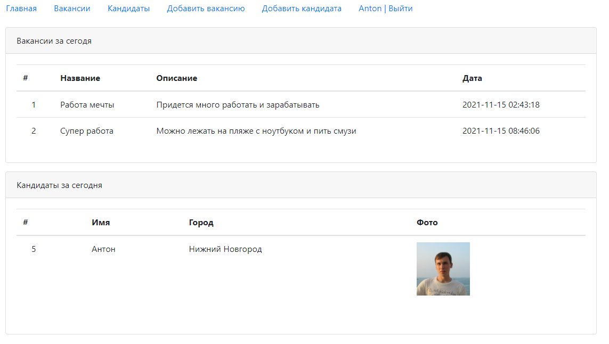
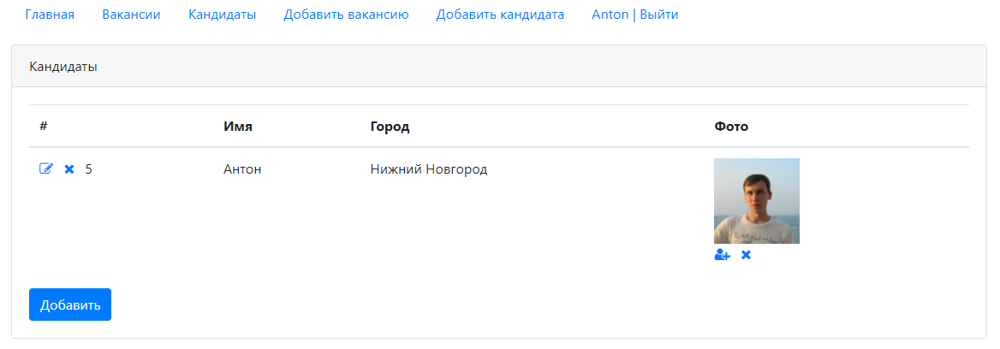
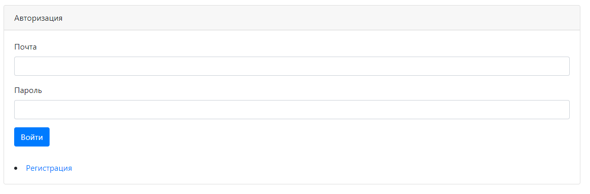
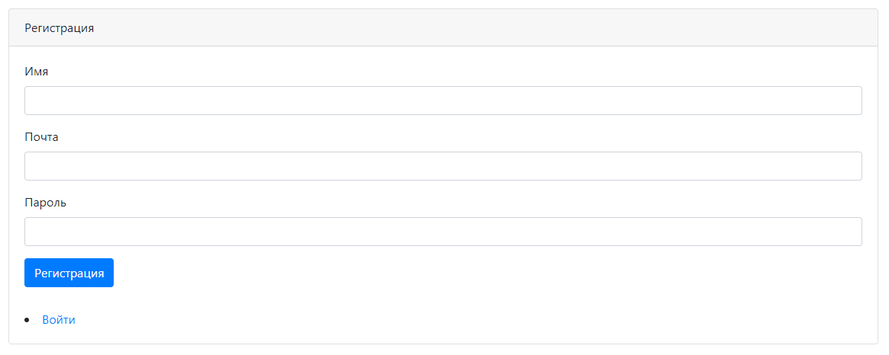

# job4j_dreamjob

В системе есть два типа пользователей: кандидаты и кадровики. Кандидаты публикуют резюме. Кадровики публикуют вакансии о работе.

Кандидаты могут откликнуться на вакансию. Кадровик может пригласить на вакансию кандидата.

